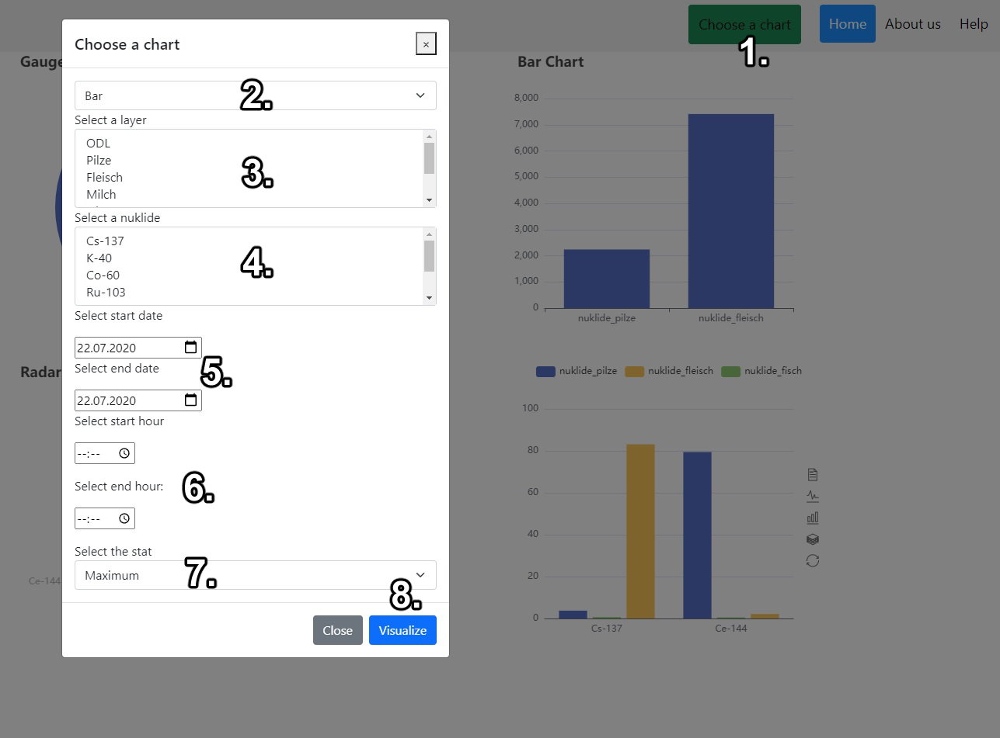

# Open-Source Radiological Service Dashboard, Germany

## Table of Contents
1. [Description](##Description)
2. [How to install and run the project](##How-to-install-and-run-the-project)
3. [How to use the project](##How-to-use-the-project)
4. [Credits](##Credits)
5. [Licenses](##Licenses)

## 1. Description

* #### What is this project about?
This software project features a radiological dashboard, based on the data and services provided by the Federal Office of Radiation Protection, Fribourg, Germany. The website uses the same web feature services provided by the Federal Office of Radiation Protection, Germany, featuring the measurements of various nucleids and the local gamma dose radiation rate throughout Germany. Those values can be requested and visualized in a variety of eCharts.

* #### Background
This software project was designed, programmed and published as part of the course "Open Source GIS" of the masters program Geomatics at the University of Applied Sciences Karlsruhe. The students were tasked to form groups and either start a new software project, or expand on an already existing project from previous semesters. The final product must be open-source as well.

* #### What did we learn?
Over the course of the project we learned how to use and distribute open source software, how to create programs that makes use of other open source software and data, and how to access and use geospatial data as a service (namely a web feature service). Furthermore we learned the proper applied usage of git as well as services of GitHub, and thus how to organize and handle the development of a software project.

## 2. How to install and run this project
Your device must be able to run JavaScript based applications. If you want to not only use it in your browser, your device must also be able to set up and host a server of your choosing.

To install the program simply download the entire project folder and unzip it into the desired target destination folder.

To run the program select and open the __index.html__ file. Your default browser will open the .html file and grant you access to the functionalities provided by this project.

## 3. How to use this project
* ### Front Page
In order to visualize certain values, you must go through the following steps:

  1. Click on the "Choose a chart" button
  2. Choose one of the available chart types (Bar, Line, Gauge, Radar)
  3. Select one of the available layers (Local Gamma Dose Rate(ODL), various types of food, and Gamma Aerosoles)
  4. Choose one of the nucleids
  5. Define the start and end date
  6. Define the start and end time
  7. Select a stat (maximum, minimum, average)
  8. Click "Visualize"

 The widget showing the selected chart will be updated to match your request.
 You can return to this page at any time by clicking the "Home" button in the top right corner.
 

* ### About Us
This page features flipcarts that you can provide with pictures and information regarding the people featured on this page. By default the profile pictures and university email adresses of the project participants of Viva-eCharts are listed.
* ### Help
This page provides further information about how to use this website. The text listed here is equivalent to chapter 3. and 4. of this Readme file.

## 4. Credits
- Dr. Marco Lechner
- [Kevin Klöditz](mailto:klke1019@h-ka.de)
- Manuel Miñambres​
- Javier Roig
- Ana Sánchez
- Jenny Unger

This project was developed within the scope of the master course "Geomatics", namely the course "Open Source GIS", at the University of Applied Sciences, Karlsruhe. In case one or all of the linked email addresses are out of commission, please refer to this master course at the faculty for Information Management and Media.Neither the University nor the students assume liability of correctness of this document and the absence of errors in this program.

## 5. Licenses
This software is distributed under the [Apache License, Version 2.0](https://www.apache.org/licenses/LICENSE-2.0.txt). It makes use of various JavaScript libraries, which were released and/or maintained under one of the following licenses:
- [Apache License, Version 2.0](https://www.apache.org/licenses/LICENSE-2.0.txt)
- [FreeBSD License](https://www.freebsd.org/copyright/freebsd-license/)
- [MIT License](https://opensource.org/licenses/MIT)

The full text of those licenses can be found in the file "LICENSES".
